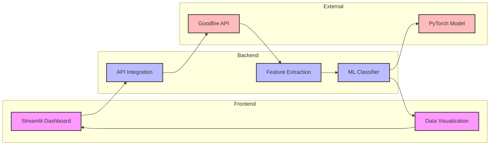
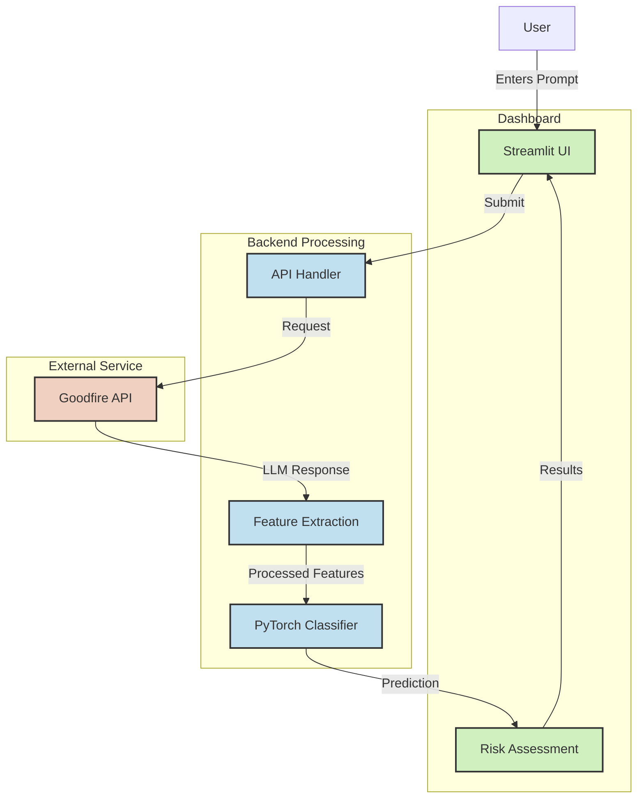

# Mech Interp Red Teaming

A dashboard for analyzing and testing prompts for potential red team attacks using mechanistic interpretability and machine learning.


## Overview

This tool provides a streamlined interface for evaluating the risk level of potential red team prompts. It uses a combination of:

1. The Goodfire API to analyze prompt responses
2. A custom binary classifier trained on mechanistic interpretability data
3. A visual dashboard for real-time prompt testing and risk assessment

## Features

- **Prompt Testing**: Enter prompts and get immediate risk analysis
- **Attack Probability**: Quantitative assessment of attack success likelihood
- **Risk Level Categorization**: Low, Medium, or High risk classification
- **Machine Learning Backend**: Trained on mechanistic interpretability data to identify patterns in successful attacks

## Installation

### Prerequisites

- Python 3.8+
- PyTorch
- Streamlit
- Pandas, NumPy, Plotly
- Goodfire API access

### Setup

1. Clone the repository:
   ```bash
   git clone https://github.com/yourusername/mech-interp-red-teaming.git
   cd mech-interp-red-teaming
   ```

2. Install dependencies:
   ```bash
   pip install -r requirements.txt
   ```

3. Set up environment variables:
   Create a `.env` file in the project root and add:
   ```
   GOODFIRE_API_KEY=your_api_key_here
   ```

## Usage

1. Start the Streamlit app:
   ```bash
   streamlit run app.py
   ```

2. Open your browser and navigate to `http://localhost:8501`

3. Enter a prompt in the text area and click "Analyze Prompt"

4. Review the risk assessment results, including:
   - Attack probability
   - Risk level
   - Feature importance (if available)

## Technical Details

### Architecture

The application consists of three main components:

1. **Frontend**: Streamlit-based dashboard (`app.py`)
2. **API Integration**: Goodfire API client for LLM response generation
3. **Classifier**: PyTorch neural network for risk prediction (`classifier.py`)



### The Classifier

The binary classifier is a 3-layer MLP (Multi-Layer Perceptron) trained on mechanistic interpretability data from successful and unsuccessful red team attacks. It processes features extracted from LLM responses to predict attack success probability.

Key aspects:
- Input features are standardized before prediction
- The model uses dropout layers for regularization
- Training metrics include accuracy and loss curves

### Data Pipeline

1. User submits a prompt
2. Prompt is sent to Goodfire API
3. API response is inspected for key features
4. Features are processed and passed to the classifier
5. Risk assessment is displayed to the user

#### System Flow Diagram



## Development

### Model Training

To retrain the classifier on new data:

```bash
python classifier.py
```

This will save a new model to `binary_classifier.pt`.

### Adding New Features

To extend the dashboard with new features:
1. Modify `app.py` to include your new UI elements
2. Update the classifier if needed to handle new feature types
3. Test thoroughly with various prompt types

## License

[Your License Here]

## Acknowledgments

- Goodfire API for LLM access
- [Any other acknowledgments]
